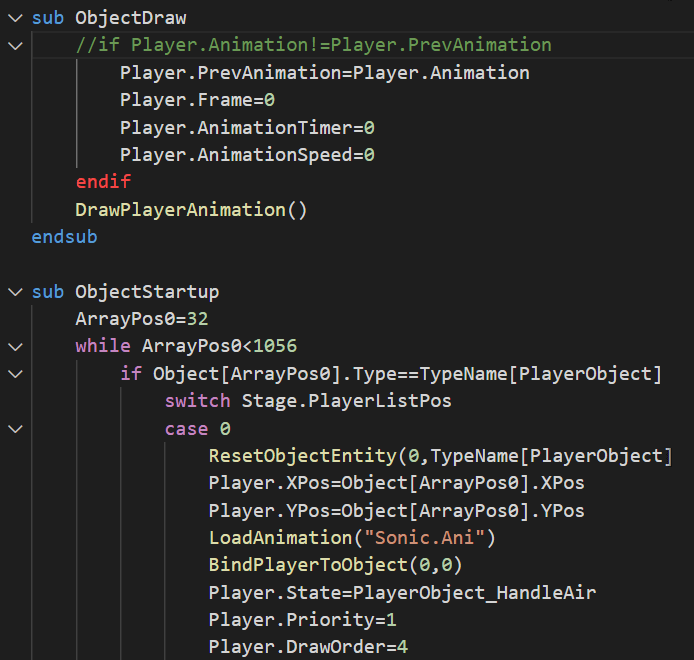

# RSDK Script for Visual Studio Code

Extension for Visual Studio code to easily edit the decompiled scripts from the remasters of [Sonic CD](https://github.com/Rubberduckycooly/Sonic-CD-2011-Script-Decompilation) and [Sonic the Hedgehog 1/2](https://github.com/Rubberduckycooly/Sonic-1-Sonic-2-2013-Script-Decompilation).

## Features

The only working feature at the moment is some basic syntax highlighting. There is the idea of including error checking and auto-completion, but no active plans to support it in a near future.



## Known Issues

The following code will return a false error:

```c
#platform: Standard
    if Variable == 1
#endplatform
#platform: Mobile
    if Variable == 2
#endplatform
        Foo()
    endif
```

## Release Notes

Please refer to the [changelog page](CHANGELOG.md) to know about the most recent release notes.
